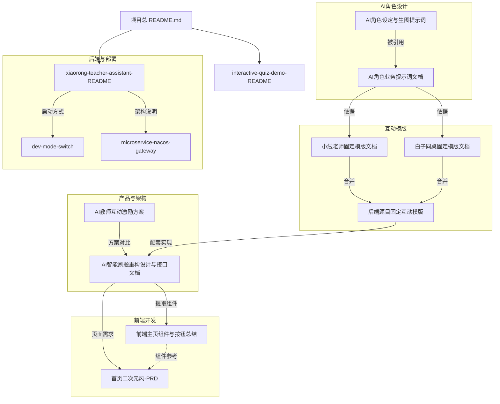

# 开发文档索引

> 本项目所有开发文档已统一归档到此目录（`dev-docs/`）。
> 本文档串联所有文档，方便项目对接和新人上手。
> 个人 API Key 安全配置与可见 AI 学习链路已于 2026-07-16 完成落地：按用户 AES-GCM 加密、Secret 缺失偏好容错、可信 Provider/动态模型切换、课堂 SSE、低分讲评和个性化建议均已实现；面试官完整业务 4.3 暂缓。

---

## 一、文档总览

| 序号 | 文档名称 | 原位置 | 类别 |
|------|---------|--------|------|
| 1 | [项目总 README](../README.md) | 项目根目录（未搬运） | 项目概览 |
| 2 | [interactive-quiz-demo-README](./interactive-quiz-demo-README.md) | `interactive-quiz-demo/` | 项目概览 |
| 3 | [xiaorong-teacher-assistant-README](./xiaorong-teacher-assistant-README.md) | `xiaorong-teacher-assistant/` | 项目概览 |
| 4 | [AI角色设定与生图提示词](./AI角色设定与生图提示词.md) | `interactive-quiz-demo/` | AI角色设计 |
| 5 | [AI角色业务提示词文档](./AI角色业务提示词文档.md) | `interactive-quiz-demo/` | AI角色设计 |
| 6 | [小绒老师固定模版文档](./小绒老师固定模版文档.md) | `interactive-quiz-demo/` | 互动模版 |
| 7 | [白子同桌固定模版文档](./白子同桌固定模版文档.md) | `interactive-quiz-demo/` | 互动模版 |
| 8 | [后端题目固定互动模版（小绒老师+白子同桌）](./后端题目固定互动模版（小绒老师+白子同桌）.md) | `interactive-quiz-demo/` | 互动模版 |
| 9 | [AI教师互动激励方案](./AI教师互动激励方案.md) | `interactive-quiz-demo/` | 产品方案 |
| 10 | [AI智能刷题重构设计与接口文档](./AI智能刷题重构设计与接口文档.md) | `interactive-quiz-demo/` | 架构设计 |
| 11 | [前端主页组件与按钮总结](./前端主页组件与按钮总结.md) | `interactive-quiz-demo/` | 前端开发 |
| 12 | [首页二次元风-PRD](./首页二次元风-PRD.md) | `xiaorong-teacher-assistant/docs/` | 前端开发 |
| 13 | [dev-mode-switch（单体/微服务模式切换）](./dev-mode-switch.md) | `xiaorong-teacher-assistant/docs/` | 部署运维 |
| 14 | [microservice-nacos-gateway（微服务接入说明）](./microservice-nacos-gateway.md) | `xiaorong-teacher-assistant/docs/` | 部署运维 |
| 15 | [角色资产与功能改进计划](./角色资产与功能改进计划.md) | 本文档 | 规划 |
| 16 | [角色完整设计](./角色完整设计.md) | 本文档 | 角色设计 |
| 17 | [待做任务清单](./待做任务清单.md) | 本文档 | 规划 |
| 18 | [用户 API Key 与模型切换安全设计](./2026-07-15-user-api-key-model-security-design.md) | 本文档 | 安全架构 |
| 19 | [用户 API Key 与模型切换实施计划](./2026-07-16-user-api-key-model-switch-implementation-plan.md) | 本文档 | 实施计划 |
| 20 | [自由对话与用户薄弱点概览设计](./2026-07-16-free-conversation-design.md) | 本文档 | AI 架构 |
| 21 | [自由对话与薄弱点概览实施计划](./2026-07-16-free-conversation-implementation-plan.md) | 本文档 | 实施计划 |
| 22 | [可见 AI 课堂接入修正设计](./2026-07-16-visible-ai-integration-design.md) | 本文档 | AI 架构 |
| 23 | [可见 AI 课堂接入实施计划](./2026-07-16-visible-ai-integration-implementation-plan.md) | 本文档 | 实施计划 |

> **未搬运的关联文件**（仍在原位置，仅供参考）：
> - `xiaorong-teacher-assistant/docs/mysql-schema.sql` — MySQL 建表 SQL
> - `xiaorong-teacher-assistant/docs/schema-draft.sql` — Schema 草稿（未使用）
> - `frontend/Forhaed/README.md` — Frontend 前端项目搭建说明（通用 Vite 模板）

---

## 二、文档关系图



---

## 三、按角色阅读路径

### 👤 新人快速上手

```
项目总 README.md
  → interactive-quiz-demo-README（Demo 体验）
  → xiaorong-teacher-assistant-README（后端项目）
  → dev-mode-switch（本地启动）
```

### 🎨 前端开发

```
首页二次元风-PRD（首页组件需求）
  → 前端主页组件与按钮总结（所有组件清单 + API 汇总）
  → AI智能刷题重构设计与接口文档（完整 API 定义）
  → AI角色设定与生图提示词（角色素材规范）
```

### 🧠 AI / Prompt 工程师

```
AI角色设定与生图提示词（角色设计 + 生图参数）
  → AI角色业务提示词文档（业务 Prompt 工程）
  → 小绒老师固定模版文档（老师侧固定模板）
  → 白子同桌固定模版文档（同桌侧固定模板）
  → 后端题目固定互动模版（50 题完整闭环示例）
```

### 🏗️ 后端 / 架构

```
xiaorong-teacher-assistant-README（项目结构 + 核心接口）
  → AI智能刷题重构设计与接口文档（完整架构设计 + DB + API）
  → AI教师互动激励方案（产品逻辑 + 数据流）
  → microservice-nacos-gateway（微服务接入）
  → dev-mode-switch（启动模式切换）
```

### 📐 产品 / 设计

```
AI教师互动激励方案（三种互动方案对比 + 推荐）
  → AI智能刷题重构设计与接口文档（分阶段建设计划）
  → 首页二次元风-PRD（首页视觉需求）
  → AI角色设定与生图提示词（角色视觉规范）
```

---

## 四、文档内容摘要

### 4.1 项目概览

| 文档 | 核心内容 | 页数 |
|------|---------|------|
| [项目总 README](../README.md) | 项目介绍、技术栈、亮点、Docker 部署 | — |
| [interactive-quiz-demo-README](./interactive-quiz-demo-README.md) | Demo 的学习闭环流程、前端状态定义、建议后端接口 | ~50行 |
| [xiaorong-teacher-assistant-README](./xiaorong-teacher-assistant-README.md) | 后端骨架项目说明、核心接口（登录/学习/AI）、MySQL/Redis/AI配置 | ~365行 |

### 4.2 AI 角色设计

| 文档 | 核心内容 | 页数 |
|------|---------|------|
| [AI角色设定与生图提示词](./AI角色设定与生图提示词.md) | 小绒老师/白子同桌/岚川面试官的角色设定、外观描述、Midjourney/SD 生图 Prompt、全局负面提示词 | ~388行 |
| [AI角色业务提示词文档](./AI角色业务提示词文档.md) | 三大角色的业务 Prompt 模板（提问/讲解/评估/纠错/请教/复盘），Token 节省规则 | ~473行 |

### 4.3 互动模版

| 文档 | 核心内容 | 页数 |
|------|---------|------|
| [小绒老师固定模版文档](./小绒老师固定模版文档.md) | 按分类（数据库/Java/框架/中间件/前端）的小绒老师提问、讲解、评估、纠错模版 | ~415行 |
| [白子同桌固定模版文档](./白子同桌固定模版文档.md) | 按分类的白子同桌请教、答对反馈、答错安慰、复盘陪伴模版 + 协作值规则 | ~319行 |
| [后端题目固定互动模版（小绒老师+白子同桌）](./后端题目固定互动模版（小绒老师+白子同桌）.md) | 50 道后端题目的完整闭环（讲解→提问→同桌互动→作业），含 Token 统计 | ~719行 |

### 4.4 产品方案

| 文档 | 核心内容 | 页数 |
|------|---------|------|
| [AI教师互动激励方案](./AI教师互动激励方案.md) | 三种方案对比评估（老师提问/同桌互助/混合）、推荐方案 C、可能的问题、分阶段落地建议 | ~230行 |
| [AI智能刷题重构设计与接口文档](./AI智能刷题重构设计与接口文档.md) | 完整架构设计（前端/后端/AI层）、P0/P1/P2 分阶段、领域模型、DB 表结构、API 定义、AI 接入架构、Provider 路由 | ~1339行 |

### 4.5 前端开发

| 文档 | 核心内容 | 页数 |
|------|---------|------|
| [前端主页组件与按钮总结](./前端主页组件与按钮总结.md) | 6 阶段学习流的组件拆解、各页面组件表格、核心状态类型、11 个建议组件清单 | ~170行 |
| [首页二次元风-PRD](./首页二次元风-PRD.md) | 首页 PRD（视觉方向、信息架构、组件拆分、数据契约、页面状态、验收标准） | ~373行 |

### 4.6 规划改进

| 文档 | 核心内容 | 页数 |
|------|---------|------|
| [角色资产与功能改进计划](./角色资产与功能改进计划.md) | 三角色资产盘点、面试官完整功能规划（Prompt/API/前端/DB）、待办清单 | ~300行 |
| [角色完整设计](./角色完整设计.md) | 三大角色完整生图 Prompt（含面试官）、面试官固定对话模版、自由对话 vs 固定模版边界定义、Token 预算 | ~400行 |
| [待做任务清单](./待做任务清单.md) | 从全部 dev-docs 提取的待做任务，按模块/优先级分类，含状态追踪 | ~120行 |
| [用户 API Key 与模型切换安全设计](./2026-07-15-user-api-key-model-security-design.md) | 每用户 API Key AES-GCM 加密持久化、用户隔离、可信 Provider、动态模型切换及安全边界 | ~260行 |
| [用户 API Key 与模型切换实施计划](./2026-07-16-user-api-key-model-switch-implementation-plan.md) | 加密、持久化、用户 API、动态 Gateway、前端配置页与验证的 TDD 实施步骤 | ~400行 |
| [自由对话与用户薄弱点概览设计](./2026-07-16-free-conversation-design.md) | 当前用户薄弱点与建议、最近 3 轮可见自由提问、低分异步讲评、SSE、安全运行元数据与 Token 预算；4.3 暂缓 | ~150行 |
| [自由对话与薄弱点概览实施计划](./2026-07-16-free-conversation-implementation-plan.md) | 4.1/4.2/4.4/4.5/4.6 的后端、前端、Docker 8088 与文档同步结果 | ~50行 |
| [可见 AI 课堂接入修正设计](./2026-07-16-visible-ai-integration-design.md) | 修复个人 Key 仍走 Mock、课堂 AI 不可见、深度讲评超时和首页无建议的问题 | ~80行 |
| [可见 AI 课堂接入实施计划](./2026-07-16-visible-ai-integration-implementation-plan.md) | 单线程 TDD 实施、Docker 真实链路、API Key→Provider 容错和完整验收步骤 | ~80行 |

### 4.7 部署运维

| 文档 | 核心内容 | 页数 |
|------|---------|------|
| [dev-mode-switch](./dev-mode-switch.md) | 单体模式 vs 微服务模式切换、启动顺序、切换速查表、注意事项 | ~235行 |
| [microservice-nacos-gateway](./microservice-nacos-gateway.md) | Nacos 配置中心导入、Gateway 路由、启动顺序、认证流、安全设计 | ~244行 |

---

## 五、文档依赖关系

```
AI角色设定与生图提示词.md
  └── 被引用 ──> AI角色业务提示词文档.md

AI角色业务提示词文档.md
  ├── 被引用 ──> 小绒老师固定模版文档.md（第2.1节）
  ├── 被引用 ──> 白子同桌固定模版文档.md（第2.2节）
  └── 被引用 ──> 后端题目固定互动模版.md（间接）

AI智能刷题重构设计与接口文档.md
  ├── 被引用 ──> 前端主页组件与按钮总结.md（第1节）
  ├── 被引用 ──> 首页二次元风-PRD.md（设计依据）
  └── 实现体现 ──> xiaorong-teacher-assistant-README.md（接口实现对照）

xiaorong-teacher-assistant-README.md
  ├── 启动方式 ──> dev-mode-switch.md
  └── 架构说明 ──> microservice-nacos-gateway.md
```

---

## 六、项目结构速览

```
测试2/
├── README.md                          ← 项目总 README
├── dev-docs/                          ← 所有开发文档（本目录）
│   ├── README.md                      ← 本文档（索引）
│   ├── AI角色设定与生图提示词.md
│   ├── AI角色业务提示词文档.md
│   ├── 小绒老师固定模版文档.md
│   ├── 白子同桌固定模版文档.md
│   ├── 后端题目固定互动模版（小绒老师+白子同桌）.md
│   ├── AI教师互动激励方案.md
│   ├── AI智能刷题重构设计与接口文档.md
│   ├── 前端主页组件与按钮总结.md
│   ├── 首页二次元风-PRD.md
│   ├── dev-mode-switch.md
│   ├── microservice-nacos-gateway.md
│   ├── interactive-quiz-demo-README.md
│   ├── xiaorong-teacher-assistant-README.md
│   ├── 2026-07-15-user-api-key-model-security-design.md
│   ├── 2026-07-16-user-api-key-model-switch-implementation-plan.md
│   ├── 2026-07-16-free-conversation-design.md
│   ├── 2026-07-16-free-conversation-implementation-plan.md
│   ├── 2026-07-16-visible-ai-integration-design.md
│   ├── 2026-07-16-visible-ai-integration-implementation-plan.md
│   └── 待做任务清单.md
├── interactive-quiz-demo/             ← 静态 Demo（仅含 index.html）
├── xiaorong-teacher-assistant/        ← 后端项目
│   └── docs/
│       ├── mysql-schema.sql           ← MySQL 建表文件
│       └── schema-draft.sql           ← Schema 草稿（未使用）
└── frontend/                           ← 前端项目
    └── Forhaed/
```

---

## 七、快速导航

| 我想做什么 | 看什么文档 |
|-----------|-----------|
| 了解项目整体是什么 | [项目总 README](../README.md) |
| 快速启动后端 | [xiaorong-teacher-assistant-README](./xiaorong-teacher-assistant-README.md) → [dev-mode-switch](./dev-mode-switch.md) |
| 了解 AI 角色设定 | [AI角色设定与生图提示词](./AI角色设定与生图提示词.md) |
| 写 Prompt / 调模型 | [AI角色业务提示词文档](./AI角色业务提示词文档.md) |
| 开发前端页面 | [首页二次元风-PRD](./首页二次元风-PRD.md) → [前端主页组件与按钮总结](./前端主页组件与按钮总结.md) |
| 对接后端 API | [AI智能刷题重构设计与接口文档](./AI智能刷题重构设计与接口文档.md) |
| 接入微服务 | [microservice-nacos-gateway](./microservice-nacos-gateway.md) |
| 了解互动产品逻辑 | [AI教师互动激励方案](./AI教师互动激励方案.md) |
| 查看完整刷题模板 | [后端题目固定互动模版（小绒老师+白子同桌）](./后端题目固定互动模版（小绒老师+白子同桌）.md) |
| 了解角色资产缺口和改进计划 | [角色资产与功能改进计划](./角色资产与功能改进计划.md) |
| 查看完整角色生图 Prompt + 面试官模版 + 自由对话规划 | [角色完整设计](./角色完整设计.md) |
| 查看所有待做任务清单（按优先级分类） | [待做任务清单](./待做任务清单.md) |
| 配置个人 API Key 并切换模型 | [用户 API Key 与模型切换安全设计](./2026-07-15-user-api-key-model-security-design.md) |
| 实现自由对话、深度讲评和用户薄弱点 | [自由对话与用户薄弱点概览设计](./2026-07-16-free-conversation-design.md) → [可见 AI 修正设计](./2026-07-16-visible-ai-integration-design.md) → [实施计划](./2026-07-16-visible-ai-integration-implementation-plan.md) |
