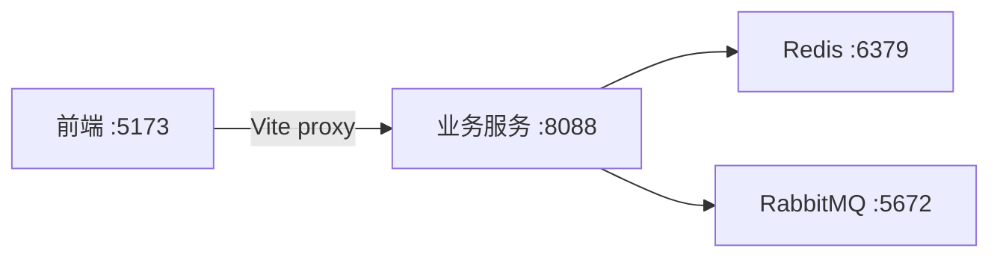
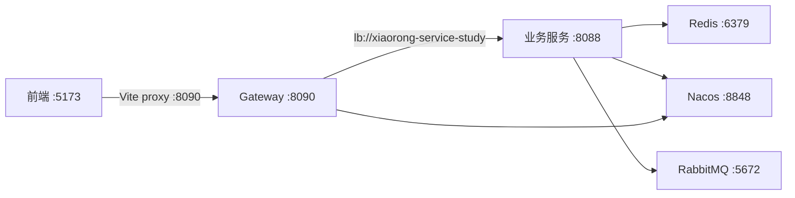

# 单体模式 / 微服务模式 切换说明

## 两种模式对比

| | 单体模式（本地联调） | 微服务模式（全链路） |
|---|---|---|
| **适用场景** | 快速开发、调试业务逻辑 | 测试网关、Nacos 配置、全链路 |
| **Nacos** | ❌ 不需要 | ✅ 必须启动 |
| **Gateway** | ❌ 不需要 | ✅ 必须启动 |
| **Redis** | ✅ 需要 | ✅ 需要 |
| **RabbitMQ** | ✅ 课程材料生成需要 | ✅ 课程材料生成需要 |
| **业务服务** | ✅ 单独启动 | ✅ 注册到 Nacos |
| **前端 proxy** | `localhost:8088` | `localhost:8090`（走网关） |

---

## 单体模式（Standalone）

### 启动的服务

```
1. Redis        → localhost:6379
2. RabbitMQ     → localhost:5672
3. 业务服务      → localhost:8088
```

### 启动步骤

**1. Redis**

```powershell
# 如果没启动
Start-Process -NoNewWindow -FilePath "C:\Redis\redis-server.exe" -ArgumentList "C:\Redis\redis.windows.conf"
```

**2. RabbitMQ**

```powershell
docker run -d --name xiaorong-rabbitmq -p 5672:5672 -p 15672:15672 rabbitmq:3.13-management
```

**3. 业务服务**

```powershell
# 在 xiaorong-teacher-assistant 目录下
# 方式 A：直接运行 jar（已有构建产物）
java -jar target\xiaorong-teacher-assistant-0.0.1-SNAPSHOT.jar

# 方式 B：Maven 启动（自动编译）
mvn spring-boot:run
```

> `bootstrap.properties` 默认使用 `SPRING_CLOUD_NACOS_DISCOVERY_ENABLED=false`、`SPRING_CLOUD_NACOS_CONFIG_ENABLED=false`，单体模式不会创建 Nacos Config/Discovery 客户端，也不会持续连接 `127.0.0.1:8848/9848`。

**4. 前端**

```powershell
# 在 frontend\Forhaed 目录下
npm run dev
```

不设 `VITE_API_BASE_URL`，默认走 `http://localhost:8088`。



---

## 微服务模式（全链路）

### 启动顺序（严格按此顺序）

```
1. Redis        → localhost:6379
2. RabbitMQ     → localhost:5672
3. Nacos        → localhost:8848
4. 业务服务      → localhost:8088（注册到 Nacos）
5. Gateway      → localhost:8090（注册到 Nacos）
6. 前端          → localhost:5173（proxy → 8090）
```

### 启动步骤

**1. Redis**

```powershell
Start-Process -NoNewWindow -FilePath "C:\Redis\redis-server.exe" -ArgumentList "C:\Redis\redis.windows.conf"
```

**2. RabbitMQ**

```powershell
docker run -d --name xiaorong-rabbitmq -p 5672:5672 -p 15672:15672 rabbitmq:3.13-management
```

**3. Nacos**

```powershell
# Nacos 安装路径 D:\soft\nacos
cd D:\soft\nacos\bin

# 使用 startup.cmd 启动（会开新窗口）
.\startup.cmd -m standalone

# 或者直接 Java 启动
$java = "$env:JAVA_HOME\bin\java.exe"
$opts = "-Xms512m -Xmx512m -Xmn256m -Dnacos.standalone=true -Dloader.path=D:\soft\nacos\plugins -jar D:\soft\nacos\target\nacos-server.jar"
$config = "--spring.config.additional-location=file:D:\soft\nacos\conf\"
$log = "--logging.config=D:\soft\nacos\conf\nacos-logback.xml"
Start-Process -NoNewWindow -FilePath $java -ArgumentList "$opts $config $log"
```

验证 Nacos 启动成功：

```powershell
curl.exe -s "http://localhost:8848/nacos/v1/cs/configs?dataId=common-config.yaml&group=XIAORONG_TEACHER"
```

返回配置内容即正常。

**4. 业务服务**

```powershell
# 在 xiaorong-teacher-assistant 目录下
$env:SPRING_CLOUD_NACOS_DISCOVERY_ENABLED='true'
$env:SPRING_CLOUD_NACOS_CONFIG_ENABLED='true'
java -jar target\xiaorong-teacher-assistant-0.0.1-SNAPSHOT.jar
```

启动后查看 Nacos 控制台 → **服务管理 → 服务列表**，应该能看到 `xiaorong-service-study` 已注册。

**5. Gateway**

```powershell
# 在 xiaorong-teacher-assistant\xiaorong-gateway 目录下
# 先构建（如果没构建过）
mvn package -DskipTests

# 启动网关
java -jar target\xiaorong-gateway-0.0.1-SNAPSHOT.jar
```

启动后查看 Nacos 服务列表，应该能看到 `xiaorong-gateway` 已注册。

验证网关是否正常：

```powershell
# 不走网关 -> 直接调业务服务
curl.exe http://localhost:8088/api/auth/me

# 走网关 -> 验证路由转发
curl.exe http://localhost:8090/api/auth/me
```

两条都应该返回同样的结果（网关把 `/api/**` 路由到业务服务）。

**6. 前端**

```powershell
# 在 frontend\Forhaed 目录下

# PowerShell
$env:VITE_API_BASE_URL='http://localhost:8090'; npm run dev

# CMD
set VITE_API_BASE_URL=http://localhost:8090 && npm run dev
```

设环境变量 `VITE_API_BASE_URL=http://localhost:8090`，Vite proxy 走网关。



---

## 切换速查表

| 动作 | 单体模式 | 微服务模式 |
|------|---------|-----------|
| **Redis** | `Start-Process ... redis-server` | 同左 |
| **RabbitMQ** | `docker run ... rabbitmq:3.13-management` | 同左 |
| **Nacos** | 不启动 | `startup.cmd -m standalone` |
| **业务服务** | `java -jar ...`（Nacos 默认关闭） | 先设置两个 `SPRING_CLOUD_NACOS_*_ENABLED=true`，再启动同一 JAR |
| **Gateway** | 不启动 | `java -jar xiaorong-gateway-...jar` |
| **前端启动** | `npm run dev` | `$env:VITE_API_BASE_URL='http://localhost:8090'; npm run dev` |

### 切换示例

**单体 → 微服务：**

```powershell
# 1. 启动 Nacos（如未启动）
cd D:\soft\nacos\bin
.\startup.cmd -m standalone

# 2. 重启业务服务（新开终端，显式启用 Nacos）
cd xiaorong-teacher-assistant
$env:SPRING_CLOUD_NACOS_DISCOVERY_ENABLED='true'
$env:SPRING_CLOUD_NACOS_CONFIG_ENABLED='true'
java -jar target\xiaorong-teacher-assistant-0.0.1-SNAPSHOT.jar

# 3. 启动网关（新开终端）
cd xiaorong-teacher-assistant\xiaorong-gateway
java -jar target\xiaorong-gateway-0.0.1-SNAPSHOT.jar

# 4. 重新启动前端，设置环境变量走网关
cd ..\frontend\Forhaed
$env:VITE_API_BASE_URL='http://localhost:8090'; npm run dev
```

**微服务 → 单体：**

```powershell
# 1. 停掉 Gateway 和启用了 Nacos 的业务服务（Ctrl+C）
# 2. 清除 Nacos 开关并按单体模式重启业务服务
Remove-Item Env:SPRING_CLOUD_NACOS_DISCOVERY_ENABLED -ErrorAction SilentlyContinue
Remove-Item Env:SPRING_CLOUD_NACOS_CONFIG_ENABLED -ErrorAction SilentlyContinue
java -jar target\xiaorong-teacher-assistant-0.0.1-SNAPSHOT.jar

# 3. 重新启动前端，不设环境变量
cd ..\frontend\Forhaed
npm run dev   # 默认走 8088
```

---

## 注意事项

1. **业务服务本身不需要改代码**，单体模式和微服务模式用的是同一个 jar，差别仅在于前端 proxy 目标 + 是否启动 Nacos/Gateway。

2. **业务服务的 `bootstrap.properties` 保留 Nacos 地址，但默认关闭客户端**。微服务模式必须显式设置 `SPRING_CLOUD_NACOS_DISCOVERY_ENABLED=true` 和 `SPRING_CLOUD_NACOS_CONFIG_ENABLED=true`；单体模式保持默认 false。

3. **Gateway 的 `bootstrap.properties` 需要更新 shared-configs group**，当前是 `DEFAULT_GROUP`，应改为 `XIAORONG_TEACHER` 以匹配业务服务：
   ```properties
   spring.cloud.nacos.config.shared-configs[0].group=XIAORONG_TEACHER
   ```

4. **Docker Compose 默认按单体模式运行**，无需启动 Nacos。若日志仍出现 `127.0.0.1:9848` 重连，确认运行的是最新 JAR/镜像，并检查两个 `SPRING_CLOUD_NACOS_*_ENABLED` 环境变量没有被设为 `true`。

5. **Redis 两个模式都需要**，如果 Redis 没启动业务服务会报连接错误。

6. **RabbitMQ 现在也属于业务服务依赖**。后台课程材料生成接口会先投递 `GENERATE_LESSON_MATERIAL`，再由业务服务内监听器消费并写入 `ai_lesson_material` / Redis。

7. **前端 Docker 构建上下文是 `frontend/Forhaed`**。生产构建只会复制该目录内的文件，`src/` 中的运行时辅助脚本导入必须指向前端项目内文件，不能回退到仓库根目录，否则容器内 `npm run build` 会出现 `UNRESOLVED_IMPORT`。
